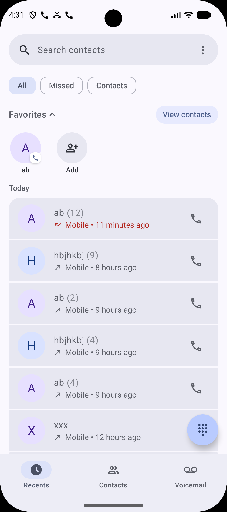
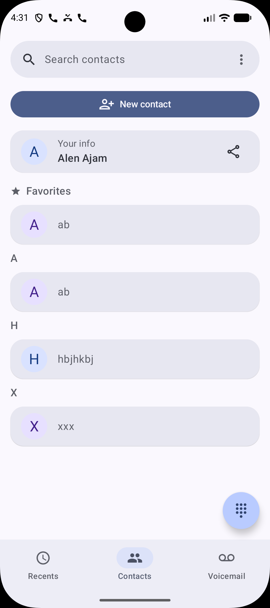
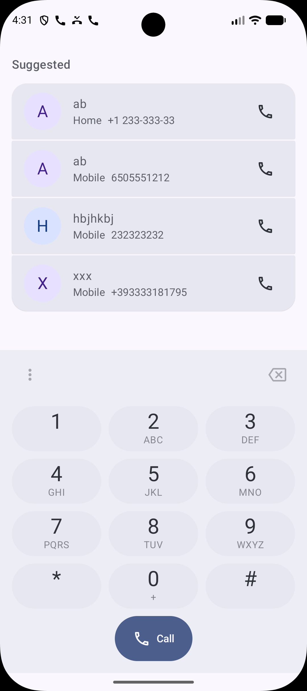
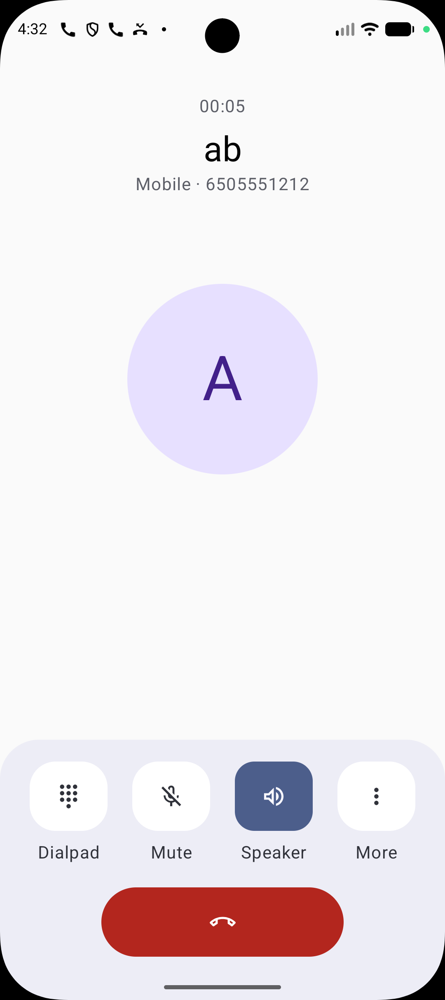
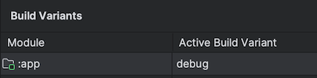

# OpenDialer

OpenDialer is an open-source Android phone app that provides a clean, modern calling experience. Manage contacts and recent calls, place and receive calls, and use an in-call interface built for everyday use.

OpenDialer must be selected as the device's default phone app to make and receive calls.

[Join our community on Discord](https://discord.gg/hKXzFFMTFN)

**Table of Contents**

- [Features](#features)
- [Screenshots](#screenshots)
- [Build and Run](#build-and-run)
- [Tech Stack](#tech-stack)
- [Modularization](#modularization)
- [Roadmap](#roadmap)
- [Releases](#releases)
- [Contributing](#contributing)
- [License](#license)

## Features

- Recents call log
- Contacts list
- Dial a number to call/message/add to contacts
- In-Call interface
- Call conferences
- Hang up with customized quick answers

## Screenshots

| Recents | Contacts |
| :---: | :---: |
|  |  |
| **Dialpad** | **In-Call** |
|  |  |

## Build and Run

**OpenDialer** uses the Gradle build system and can be imported directly into Android Studio (make
sure you are using the latest stable version
available [here](https://developer.android.com/studio)).

Change the run configuration to `app`.

The app contains the usual `debug` and `release` build variants which can be built and run.

Once you're up and running, you can refer to the learning journeys below to get a better
understanding of which libraries and tools are being used, the reasoning behind the approaches to
UI, testing, architecture and more, and how all of these different pieces of the project fit
together to create a complete app.

## Tech Stack

- JDK 17
- Android API 24+
- ViewModel and LiveData
- Kotlin Coroutines and Flow
- Dagger Hilt

## Modularization

The **OpenDialer** app has been fully modularized based on
the [official recommendations](https://developer.android.com/topic/modularization/patterns) and you
can find the
description of the modularization strategy used in
[modularization learning journey](./docs/ModularizationLearningJourney.md).

## Roadmap

Development progress is tracked in the [roadmap](https://github.com/users/oxcened/projects/3).

## Releases

Maintainers should follow the [release guide](./docs/releases.md) to publish a
signed APK and its checksum. GitHub-generated notes on each release page are
the project's changelog.

## Contributing

If you're interested in contributing, please read the [contributing docs](./CONTRIBUTING.md).

## License

OpenDialer is available under the [Apache 2.0 License](./LICENSE).
